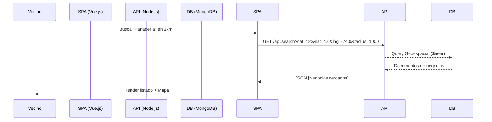

# Diseño de Arquitectura Técnica (Architecture)

Este documento describe la estructura de alto nivel y los patrones de diseño para el sistema BarrioConecta.

## Resumen del Stack Técnico
- **Frontend**: Vue.js 3 (Composition API) + Pinia (Gestión de Estado) + Tailwind CSS (Estilos).
- **Backend**: Node.js + Express.js (REST API).
- **Base de Datos**: MongoDB Atlas (NoSQL).
- **Control de Versiones**: Git + GitHub.
- **Despliegue**: Vercel (FE) y Render (BE).

## Patrones de Arquitectura
Se implementará una **Arquitectura de Capas** desacoplada (Frontend-Backend) estructurada de la siguiente manera:

### 1. Capa de Presentación (Frontend)
- **Componentes Atómicos**: Reutilización de elementos UI (Botones, Inputs, Cards).
- **Servicios**: Capa encargada de la comunicación HTTP (`Axios`) con el backend.
- **Stores**: Estados reactivos para persistir datos del usuario y resultados de búsqueda.

### 2. Capa de Lógica (Backend)
- **Controladores**: Reciben peticiones HTTP y formatean respuestas.
- **Servicios de Negocio**: Contienen la lógica pura (ej. cálculos de geolocalización, promedios de reviews).
- **Middlewares**: Autenticación JWT, validación de esquemas (Joi), control de errores global.

### 3. Capa de Datos (Persistence)
- **Modelos Mongoose**: Definición de esquemas y tipos.
- **Índices**: Optimización de búsquedas geoespaciales y unicidad de emails.

## Diagrama de Comunicación (Mermaid)


## Estructura de Proyecto Sugerida (Screaming Architecture)
```text
/src
  /api-gateway (Express)
    /controllers
    /models
    /services
    /middlewares
    /routes
  /web-client (Vue)
    /components
    /views
    /stores
    /assets
    /utils
```
