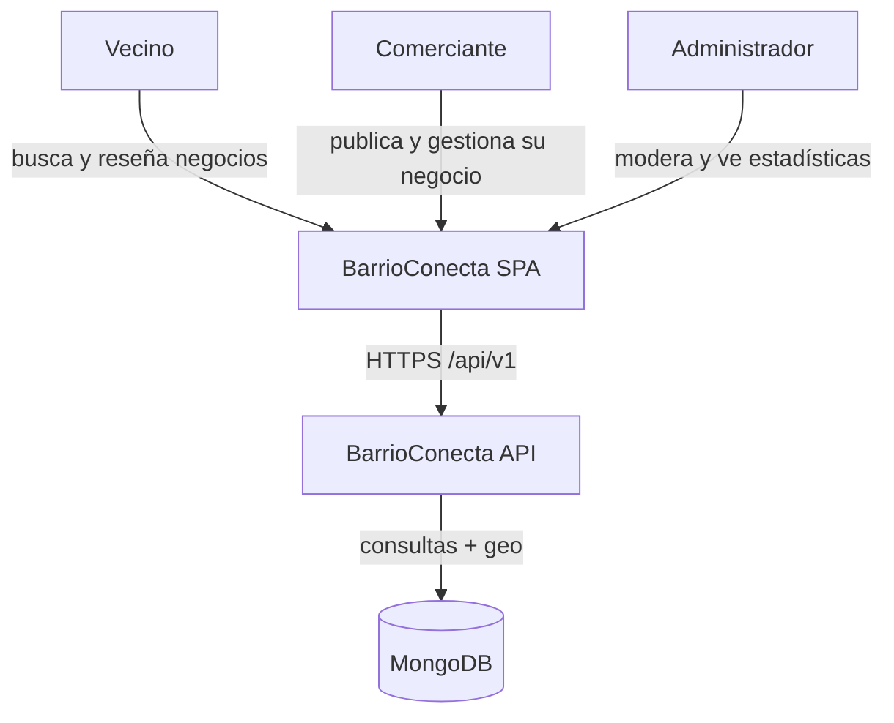
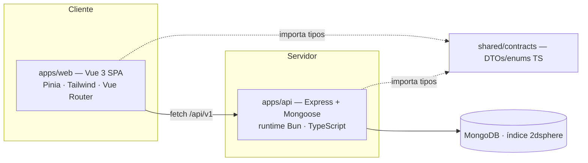
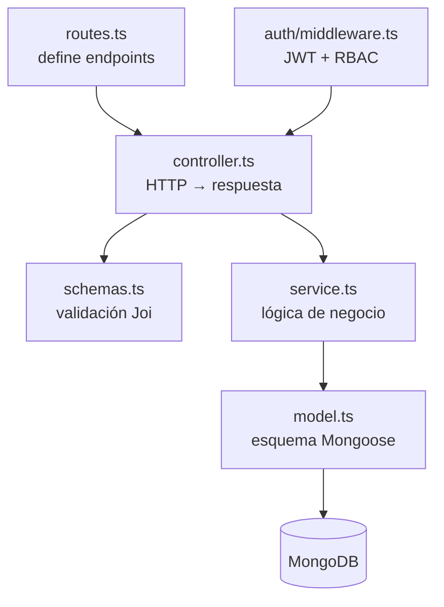
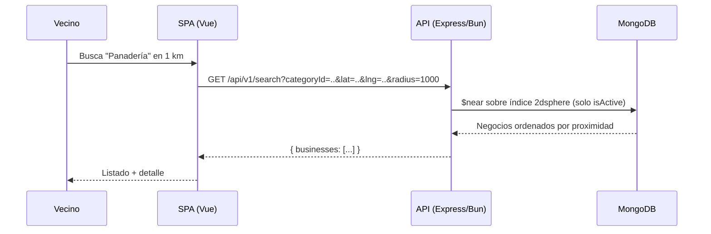

# Arquitectura

> Esta página reconcilia la narrativa original (Node.js + carpetas `server/`/`client/`) con el
> **código real**: un monorepo **Bun + TypeScript**. El backend usa Express y Mongoose, pero
> corre sobre el runtime de Bun. Detalle de diseño en [`docs/design/`](../design/).

## C4 — Nivel 1: Contexto

## C4 — Nivel 2: Contenedores

- **`apps/web`** — SPA Vue 3. Vistas por ruta, componentes reutilizables, composables (búsqueda,
  geolocalización), stores Pinia y un cliente HTTP tipado.
- **`apps/api`** — API REST Express sobre Bun. Rutas montadas bajo `/api/v1`.
- **`shared/contracts`** — fuente única de DTOs y enums TypeScript compartidos entre FE y BE.

## C4 — Nivel 3: Componentes del backend (arquitectura por capas)

Cada módulo de dominio (`auth`, `businesses`, `search`, `reviews`, `admin`, `categories`) sigue
la misma estructura en capas:

- **Routes** — declaran rutas y middlewares (autenticación, rol).
- **Controllers** — reciben la request, validan con Joi y formatean la respuesta.
- **Services** — lógica pura: hash/JWT, cálculo de `avgRating`, distancia geoespacial, reglas
  de negocio (p. ej. **BM-02**: un negocio activo por comerciante).
- **Models** — esquemas Mongoose; `Business.location` tiene índice `2dsphere` para `$near`.
- **Middleware** — `authenticateJWT` y `requireRole` implementan el control de acceso por roles.

## Manejo de errores

Un `globalErrorHandler` centralizado traduce los `AppError(status, message)` a respuestas
`{ status, message }` y oculta los detalles de errores no operacionales (500).

## Flujo de ejemplo: búsqueda geoespacial

