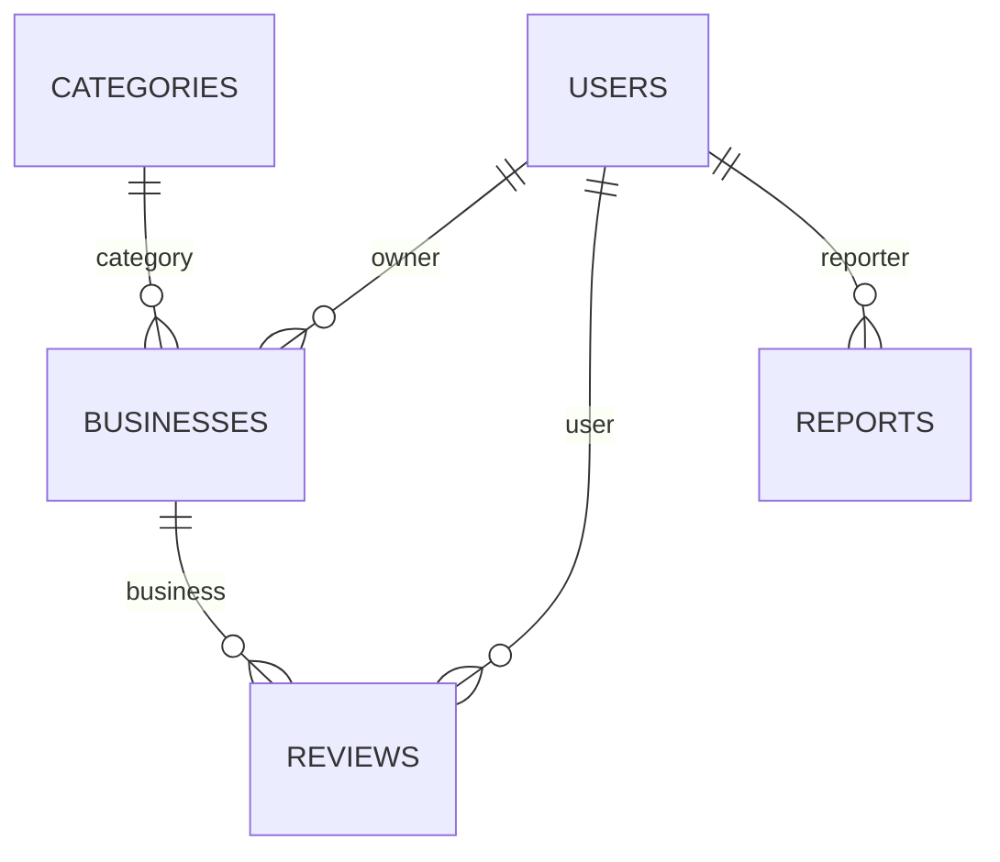

# Modelo de datos

Persistencia en **MongoDB** vía **Mongoose 8**. Cinco colecciones. Detalle ampliado en
[`docs/design/data_model.design.md`](../design/data_model.design.md).

## `users`
| Campo | Tipo | Notas |
|-------|------|-------|
| `email` | String | Único, indexado, minúsculas |
| `password` | String | Hash bcrypt (10 rondas), nunca se expone en JSON |
| `name` | String | ≤ 100 chars |
| `role` | Enum | `merchant` · `admin` · `neighbor` (default `neighbor`) |
| `createdAt` | Date | `timestamps` |

## `businesses`
| Campo | Tipo | Notas |
|-------|------|-------|
| `name` | String | 3–100 chars |
| `description` | String | ≤ 500 chars |
| `category` | ObjectId | → `categories` |
| `owner` | ObjectId | → `users` |
| `location` | GeoJSON Point | `{ type:'Point', coordinates:[lng,lat] }` · índice **`2dsphere`** |
| `photos` | [String] | ≤ 3 URLs |
| `schedule` | Object | `mon`–`sun`, cada día `{ open, close }` en `HH:MM` |
| `isActive` | Boolean | Borrado lógico (BM-03); default `true` |
| `avgRating` | Number | 0–5, recalculado tras cada reseña (RV-02) |

> **Reglas clave:** BM-02 — un comerciante puede tener un solo negocio activo.
> El índice `2dsphere` habilita las consultas `$near` ordenadas por proximidad (GS-02).

## `categories`
| Campo | Tipo | Notas |
|-------|------|-------|
| `name` | String | Único |
| `icon` | String | Identificador de icono |

## `reviews`
| Campo | Tipo | Notas |
|-------|------|-------|
| `business` | ObjectId | → `businesses` |
| `user` | ObjectId | → `users` |
| `rating` | Number | Entero 1–5 |
| `comment` | String | ≤ 300 chars |
| `reply` | String | Respuesta del comerciante (RV-03), ≤ 300 chars |
| `createdAt` | Date | `timestamps` |

## `reports`
| Campo | Tipo | Notas |
|-------|------|-------|
| `reporter` | ObjectId | → `users` |
| `targetType` | Enum | `business` · `review` |
| `targetId` | ObjectId | Referencia al objetivo reportado |
| `reason` | Enum | `spam` · `false_info` · `inappropriate` · `other` |
| `description` | String | ≤ 500 chars |
| `status` | Enum | `NEW` · `IN_REVIEW` · `RESOLVED` |

> Al **resolver** un reporte de tipo `business` (AD-02), el negocio se desactiva y los reportes
> asociados pasan a `RESOLVED`.

Todos los esquemas exponen `id` (virtual) y ocultan `_id`/`__v` en su `toJSON`.
